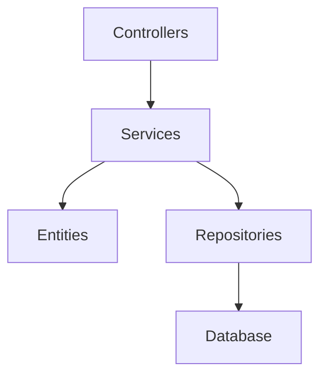
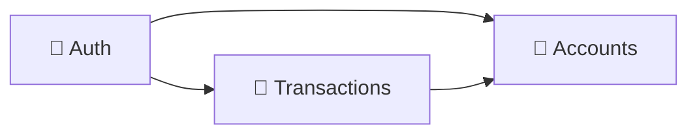
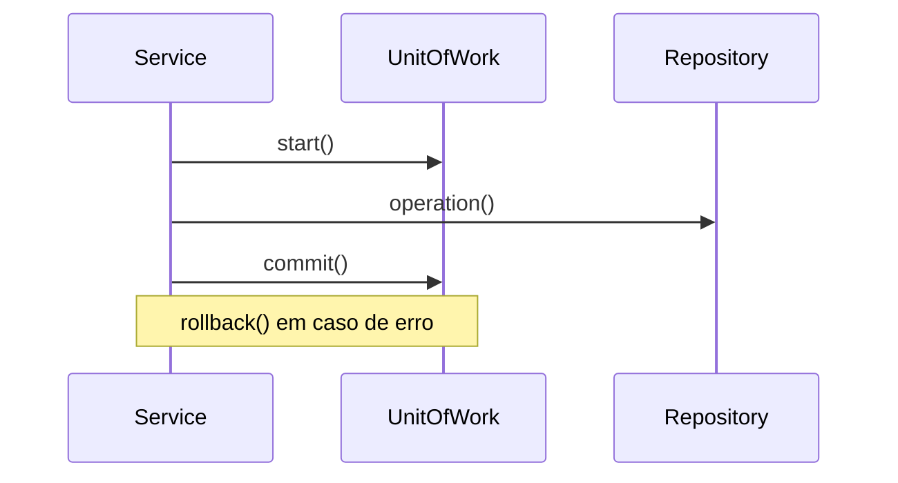
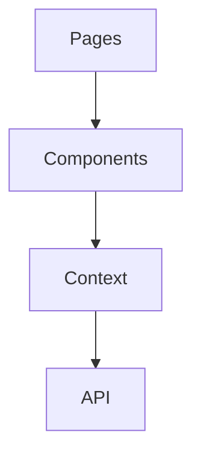

# 💸 Jovi's Bank - Techlab 2025

Minha entrega para o desafio WebApp do TechLab 2025, desafio de programação, IA e automação organizado pela Tech4Humans em parceria com o CEU UNIFEI


## 📜 Índice

- [🚀 Como rodar o projeto](#-como-rodar-o-projeto)
- [❓ Sobre](#-sobre)
- [⚛️ Tecnologias utilizadas](#-tecnologias-utilizadas)
- [🏗️ Estrutura do projeto](#-estrutura-do-projeto)
- [🤓 Principais decisões arquiteturais](#-principais-decisões-arquiteturais)
- [📈 Outros trade-offs e possíveis melhorias](#-outros-trade-offs-e-possíveis-melhorias)
- [🧠 Lógica de Desenvolvimento](#-lógica-de-desenvolvimento)
- [🧪 Testes](#-testes)

## 🚀 Como rodar o projeto

Primeiro, clone o repositório por meio do comando:

```sh
git clone https://github.com/joevtap/techlab25.git && cd techlab25
```

O projeto consiste em um _monorepo_ utilizando npm, para instalar as dependências de todos os pacotes do monorepo, utilize o comando na raiz do repositório:

```sh
npm i
```

Você pode rodar os testes por meio do comando:

```sh
npm run test
```

> Rodará os testes unitários presentes no pacote `@techlab25/backend` em `./packages`

Em uma sessão do shell, rode as migrations do banco SQLite por meio do comando:

```sh
npm run migrations -w @techlab25/backend
```

E então, rode o backend em modo de desenvolvimento com:

```sh
npm run dev:backend
```

> Rodará o backend em modo de desenvolvimento utilizando as variáveis de ambiente definidas em `./packages/backend/.env.development`

Em outra sessão do shell, rode o frontend em modo de desenvolvimento com:

```sh
npm run dev:frontend
```

> Rodará o frontend em modo de desenvolvimento utilizando as variáveis de ambiente definidas em `./packages/frontend/.env.development`

Se não modificou nenhuma variável de ambiente, o frontend estará rodando em http://localhost:5173

Acesse a referência da API do backend em http://localhost:8080/reference

## ❓ Sobre

> O enunciado do desafio se encontra [aqui](<https://github.com/tech4humans-brasil/techlab-ceu/blob/main/Finan%C3%A7as%20(Webapp)/Desafio%20WebApp.pdf>)

O projeto consiste em uma pequena aplicação financeira em que é possível criar, listar, editar e deletar contas bancárias, além de realizar operações financeiras entre elas

Além do proposto no enunciado do desafio, minha implementação inclui uma funcionalidade de cadastro e autenticação do usuário. Fiz essa adição porque senti que era algo que faltava para dar mais sentido à aplicação: contas bancárias terem donos e um usuário poder se identificar para operar apenas em cima de suas contas

A implementação consiste em um backend e um frontend, os dois utilizando a linguagem typescript e se comunicando por meio de uma API HTTP. Toda a lógica de negócios se encontra no backend, mas a validação das entradas do usuário é feita em ambas as pontas

### Processo de desenvolvimento e aprendizado

Durante o desenvolvimento, implementei inicialmente um backend completo seguindo práticas rigorosas de DDD ([versão arquivada](./archive/backend)), incluindo:

- **Value Objects**: Implementação de estado inválido irrepresentável no domínio
- **Arquitetura modular**: Organização em módulos com dependências bem definidas
- **Separation of concerns**: Camada de aplicação com casos de uso específicos

Embora eu já estivesse tentando simplificar o DDD (não implementei eventos de domínio, agregados complexos ou domain services), ainda mantive **complexidades desnecessárias** que resultaram em um código excessivamente burocrático para o escopo do projeto.

**Decisão de Refatoração**: Optei por reescrever o backend aplicando um **DDD mais pragmático**, focando na estratégia do DDD e eliminando burocracias.

**Aprendizado Principal**: Os princípios **KISS** (Keep It Simple, Stupid) e **YAGNI** (You Ain't Gonna Need It) têm importância fundamental no desenvolvimento de software. Melhores práticas de programação, embora valiosas, são **dispensáveis quando resultam em burocracia desnecessária** e reduzem a agilidade de desenvolvimento.

A versão final mantém os benefícios de design do DDD (contextos delimitados, linguagem ubíqua, separação de responsabilidades) sem a complexidade adicional que não agrega valor real ao projeto.

## ⚛️ Tecnologias utilizadas

### Backend

- **Node.js** (v22.15.1) - Runtime JavaScript server-side
- **TypeScript** - Linguagem principal para type safety e produtividade
- **Express** - Framework web minimalista para APIs HTTP
- **TypeORM** - ORM para TypeScript, escolhido por sua excelente integração com TypeScript e recursos avançados de mapeamento objeto-relacional
- **SQLite** - Banco de dados relacional embarcado, ideal para desenvolvimento e prototipagem
- **Inversify** - Container de injeção de dependências para implementar inversão de controle
- **Jest** - Framework de testes unitários
- **Zod** - Biblioteca de validação de esquemas TypeScript-first
- **bcrypt** - Para hash de senhas
- **nanoid** - Geração de IDs únicos
- **JOSE** - Implementação de JWT para autenticação
- **Scalar UI** - Interface para documentação OpenAPI

### Frontend

- **React** - Biblioteca para construção de interfaces de usuário, suficiente para o desenvolvimento do client side, sem necessidade de um framework fullstack como Next.js
- **React Router v7** - Biblioteca para roteamento client side
- **TypeScript** - Type safety no frontend
- **Vite** - Build tool moderna e rápida
- **TailwindCSS** - Framework CSS utility-first para estilização rápida
- **shadcn/ui** - Sistema de componentes baseado em Radix UI e TailwindCSS, escolhido pela qualidade dos componentes, acessibilidade nativa e facilidade de customização
- **React Hook Form** - Gerenciamento de formulários
- **Zod** - Validação de schema

### Ferramentas e customização

- **tweakcn.com** - Ferramenta utilizada para personalização do tema do shadcn/ui, permitindo gerar paletas de cores customizadas e configurações de design system específicas para o projeto
- **Modo Dark/Light** - Implementado usando a estratégia de CSS variables e _media query_ que seleciona a preferência do navegador do usuário como padrão

### Assistência de IA

- **v0.dev** - Utilizado para ideação e prototipagem rápida da interface frontend, gerando componentes React iniciais. ([Versão preliminar do v0](archive/banking-dashboard.zip))
- **GitHub Copilot** - Assistência no desenvolvimento de código, elaboração de documentação e bootstrapping de testes unitários

## 🏗️ Estrutura do projeto

O projeto está organizado como um monorepo utilizando npm workspaces, facilitando o compartilhamento de dependências e scripts entre os pacotes

```
techlab25/
├── packages/
│   ├── backend/                  # API HTTP em Node.js/TypeScript
│   │   ├── src/
│   │   │   ├── controllers/      # Controladores HTTP
│   │   │   ├── services/         # Regras de negócio
│   │   │   ├── entities/         # Entidades de domínio
│   │   │   ├── repositories/     # Interfaces e implementações de repositórios
│   │   │   ├── infrastructure/   # Configurações de infraestrutura (ORM, DI)
│   │   │   ├── dtos/             # Data Transfer Objects
│   │   │   ├── errors/           # Classes de erro personalizadas
│   │   │   └── middleware/       # Middlewares Express
│   │   └── public/               # Documentação OpenAPI
│   └── frontend/                 # Interface de usuário em React
│       ├── src/
│       │   ├── components/       # Componentes React reutilizáveis
│       │   ├── pages/            # Páginas da aplicação
│       │   ├── context/          # Context API para gerenciamento de estado
│       │   ├── hooks/            # Custom hooks
│       │   ├── types/            # Definições de tipos TypeScript
│       │   └── lib/              # Utilitários e configurações
│       └── public/               # Assets estáticos
├── docs/                         # Documentação e diagramas
└── package.json                  # Configuração do monorepo
```

### Arquitetura do backend

O backend segue os princípios da **Clean Architecture** e **Domain-Driven Design (DDD)**, organizando o código em camadas bem definidas:



### Contextos Delimitados (DDD)

A aplicação é dividida em contextos delimitados seguindo os princípios do DDD:



### Padrão Unit of Work

O backend implementa o padrão **Unit of Work** para gerenciar transações de banco de dados de forma consistente:



### Arquitetura do frontend

O frontend utiliza React com Context API para gerenciamento de estado e componentes organizados por domínio:



## 🤓 Principais decisões arquiteturais

### 1. **Monorepo com npm workspaces**

**Decisão**: Organizar o projeto como um monorepo utilizando npm workspaces  
**Justificativa**:

- Facilita o compartilhamento de dependências e configurações entre frontend e backend
- Simplifica o desenvolvimento local com scripts centralizados
- Reduz a complexidade de gerenciamento de múltiplos repositórios

### 2. **Clean Architecture + DDD no backend**

**Decisão**: Implementar Clean Architecture combinada com Domain-Driven Design  
**Justificativa**:

- **Separation of Concerns**: Cada camada tem responsabilidades bem definidas
- **Testabilidade**: Regras de negócio independentes de frameworks e infraestrutura
- **Flexibilidade**: Facilita mudanças de tecnologia sem afetar regras de negócio
- **Manutenibilidade**: Código mais legível e organizadamente estruturado
- **Domínio Central**: Regras de negócio ficam no centro, protegidas de mudanças externas

### 3. **Inversão de dependência com Inversify**

**Decisão**: Utilizar container de injeção de dependências  
**Justificativa**:

- **Desacoplamento**: Módulos dependem apenas de abstrações (interfaces)
- **Testabilidade**: Facilita criação de mocks e stubs para testes
- **Configuração Centralizada**: Todas as dependências configuradas em um local
- **Princípio da Inversão de Dependência**: Implementa o "D" do SOLID

### 4. **Padrão Unit of Work**

**Decisão**: Implementar Unit of Work para gerenciamento de transações  
**Justificativa**:

- **Consistência de Dados**: Garante que operações sejam atômicas
- **Performance**: Agrupa múltiplas operações em uma única transação
- **Controle de Concorrência**: Evita problemas de estado inconsistente
- **Rollback Automático**: Em caso de erro, todas as operações são desfeitas

### 5. **Validação dupla (frontend + backend)**

**Decisão**: Implementar validação tanto no frontend quanto no backend usando Zod  
**Justificativa**:

- **Segurança**: Backend valida independente do que vem do frontend
- **UX**: Frontend fornece feedback imediato ao usuário
- **Consistência**: Mesmo schema de validação compartilhado (Zod)
- **Programação defensiva**: Múltiplas camadas de proteção contra dados inválidos

### 6. **Tipo monetário como inteiro**

**Decisão**: Armazenar valores monetários como inteiros (centavos) no banco de dados  
**Justificativa**:

- **Precisão**: Evita problemas de arredondamento com ponto flutuante
- **Consistência**: Todos os cálculos financeiros mantêm precisão decimal
- **Performance**: Operações com inteiros são mais rápidas que decimais
- **Padrão da indústria**: Prática comum em sistemas financeiros

### 7. **SQLite para desenvolvimento**

**Decisão**: Usar SQLite como banco de dados embarcado  
**Justificativa**:

- **Simplicidade**: Zero configuração para desenvolvimento
- **Portabilidade**: Banco de dados em arquivo único
- **Desenvolvimento Rápido**: Ideal para prototipagem e testes
- **Compatibilidade**: Pode ser migrado para PostgreSQL/MySQL em produção

### 8. **Context API no frontend**

**Decisão**: Usar React Context API em vez de Redux/Zustand  
**Justificativa**:

- **Simplicidade**: Para escopo do projeto, Context API é suficiente
- **Zero dependencies**: Nativo do React, não adiciona complexidade
- **Type safety**: Integração natural com TypeScript
- **Padrão reducer**: Organiza state updates de forma previsível

### 9. **Autenticação JWT simplificada**

**Decisão**: Implementar autenticação básica stateless com JWT  
**Justificativa**:

- **Subdomínio Genérico**: Autenticação não é core business, apenas identifica usuários
- **Princípio KISS**: Implementação simples e funcional, sem refresh token
- **Escalabilidade**: Não requer armazenamento de sessão no servidor
- **Interoperabilidade**: Padrão amplamente aceito para APIs HTTP

### 10. **Aplicação estratégica do DDD**

**Decisão**: Focar no DDD Estratégico, não implementar DDD Tático completo  
**Justificativa**:

#### **DDD estratégico aplicado**:

- **Linguagem Ubíqua**: Terminologia consistente (Account, Transaction, User)
- **Contextos Delimitados**: Separação clara entre Autenticação, Contas e Transações
- **Subdomínios Core**: Gestão de contas e transações (core business)
- **Subdomínios Genéricos**: Autenticação de usuários

#### **DDD tático NÃO aplicado**:

- **Eventos de Domínio**: Comunicação direta entre serviços sem eventos assíncronos
- **Aggregates Complexos**: Entidades simples sem agregados elaborados
- **Domain Services Avançados**: Lógica concentrada nos Application Services

**Motivo**: Para o escopo do desafio, o DDD Estratégico oferece os benefícios de organização e arquitetura sem a complexidade adicional do DDD Tático completo

## 📈 Outros trade-offs e possíveis melhorias

### 1. API HTTP vs RESTful

**Decisão**: Implementar uma API HTTP simples em vez de uma API REST/RESTful completa  
**Justificativa**:

**API HTTP implementada**:

- **Métodos HTTP**: Usa GET, POST, PUT, DELETE de forma semanticamente correta
- **Status codes**: Retorna códigos de status apropriados (200, 201, 400, 404, 500)
- **JSON**: Formato padronizado para request/response
- **Endpoints resource-based**: URLs seguem padrão `/api/accounts`, `/api/transactions`

**Características REST/RESTful NÃO implementadas**:

- **HATEOAS**: Hypertext As The Engine Of Application State - navegabilidade por hiperlinks
- **Self-descriptive messages**: Links para descoberta de recursos relacionados
- **Uniform interface**: Constraints rigorosos de interface uniforme

**Motivo da escolha**: HATEOAS e aplicação rigorosa do estilo REST/RESTful envolvem complexidade de design que foge do escopo do projeto. Do ponto de vista do DDD, essas preocupações ficariam em um subdomínio genérico que optei por simplificar

**Referência**: [Sua API não é RESTful - Entenda por quê](https://blog.geekhunter.com.br/sua-api-nao-e-restful-entenda-por-que/)

### 2. Integridade referencial com ON DELETE CASCADE

**Decisão**: Usar `ON DELETE CASCADE` para manter integridade relacional quando contas são apagadas  
**Justificativa**:

**Implementação atual**:

- **Chaves estrangeiras**: Transações referenciam contas de origem e destino
- **CASCADE**: Deleção de conta remove automaticamente transações relacionadas
- **Integridade**: Evita referências órfãs no banco de dados
- **Simplicidade**: Solução direta sem lógica adicional de cleanup

**Trade-off de design**:

- **Histórico perdido**: Transações são apagadas junto com a conta
- **Não é imutável**: Contraria princípios de ledger financeiro real
- **Estado centralizado**: Saldo das contas é independente do histórico de transações

**Solução em Aplicação Real**:

- **Soft delete**: Marcar conta como inativa/deletada sem remover do banco
- **Ledger imutável**: Histórico de transações nunca deve ser alterado
- **Estado derivado**: Saldo das contas calculado a partir do histórico de transações

**Motivo da escolha**: Para o escopo do projeto, a simplicidade do CASCADE supera a complexidade de implementar um sistema de ledger imutável. O saldo independente de transações mantém consistência mesmo com o histórico apagado

### 3. Paginação de transações

**Decisão**: Não implementar paginação de transações, retornando todas as transações de uma conta em único request  
**Justificativa**:

**Implementação atual**:

- **Single request**: Todas as transações de uma conta são retornadas de uma vez
- **Simplicidade**: Sem complexidade adicional de offset/limit ou cursor pagination
- **Escopo limitado**: Para demonstração e testes, volume de dados é pequeno

**Benefícios da paginação**:

- **Performance backend**: Queries mais rápidas com LIMIT/OFFSET
- **Performance frontend**: Renderização de listas menores
- **Usabilidade**: Interface mais responsiva para grandes volumes
- **Memória**: Menor uso de RAM tanto no servidor quanto no cliente

**Casos de Uso Reais**:

- **Centenas de Transações**: Uma conta pode ter histórico extenso
- **Múltiplos Usuários**: Aplicação real com centenas de usuários simultaneamente
- **Mobile First**: Conexões mais lentas requerem payloads menores

**Motivo da escolha**: Para o escopo do desafio e tempo disponível, priorizar outras funcionalidades core foi mais importante. Em uma aplicação real, paginação seria implementada desde o princípio para garantir escalabilidade

### 4. UI otimista vs UI conservadora

**Decisão**: Implementar UI parcialmente otimista  
**Justificativa**:

**UI Otimista - Conceito**:

- **Reação imediata**: Cliente assume sucesso e atualiza estado antes da resposta do servidor
- **Reconciliação**: Estado é corrigido se servidor retornar erro
- **UX Superior**: Feedback instantâneo melhora experiência do usuário
- **Complexidade**: Requer gerenciamento sofisticado de estado

**Implementação atual**:

- **Otimista**: Operações de contas (criar, deletar, atualizar) atualizam estado imediatamente
- **Conservadora**: Transações aguardam confirmação do servidor antes de atualizar
- **Híbrida**: Combina benefícios de UX com simplicidade de implementação

**Ferramentas especializadas**:

- **TanStack Query**: Facilita implementação de UI otimista com cache inteligente
- **SWR**: Stale-while-revalidate para sincronização de estado

**Motivo da escolha**: Aplicar UI otimista em toda aplicação introduziria complexidade de gerenciamento de estado que foge do escopo

### 5. Estratégia de testes: unitários vs integração vs E2E

**Decisão**: Focar exclusivamente em testes unitários do core business, sem testes de integração ou E2E  
**Justificativa**:

**Testes implementados**:

- **Unitários**: Validam regras de negócio isoladamente
- **Core business**: Focam nas funcionalidades mais críticas e requisitadas
- **Cobertura dirigida**: Testam lógica de domínio sem dependências externas

**Tipos de teste NÃO implementados**:

- **Integração**: Módulos trabalhando em conjunto (repositórios + services)
- **E2E**: Funcionamento completo em ambiente similar à produção
- **API tests**: Validação de endpoints HTTP com banco de dados real

**Benefícios dos Testes Ausentes**:

- **Integração**: Detecta problemas na comunicação entre camadas
- **E2E**: Valida fluxos completos do usuário
- **Confiança**: Maior cobertura reduz bugs em produção

**Trade-off para Aplicações Financeiras**:

- **Criticidade**: Sistemas financeiros requerem todos os tipos de teste
- **Compliance**: Regulamentações exigem cobertura abrangente
- **Risco**: Bugs podem causar perdas financeiras significativas

**Motivo da escolha**: Para o escopo do desafio, testes unitários das regras de negócio atendem aos requisitos. Em uma aplicação real, principalmente financeira, todos os tipos de teste seriam essenciais desde o início

### 6. Workflow de versionamento: Trunk Based Development

**Decisão**: Seguir princípios do Trunk Based Development adaptados para desenvolvimento solo  
**Justificativa**:

**Trunk based development - características**:

- **Branch única**: Desenvolvimento principal na branch trunk/main
- **Integração contínua**: Mudanças integradas frequentemente
- **Branches curtas**: Feature branches existem por 1-2 dias no máximo
- **Deploy frequente**: Facilita releases com menor risco
- **Merge conflicts reduzidos**: Menos divergência entre branches

**Adaptações para projeto solo**:

- **Commits diretos**: Como o desenvolvimento é individual, commits diretos na main
- **Conventional commits**: Mensagens padronizadas para histórico claro
- **Iteração rápida**: Desenvolvimento iterativo com feedback constante
- **Sem burocracia**: Evita complexidade desnecessária de branching

**Workflows NÃO utilizados**:

- **GitFlow**: Múltiplas branches (develop, feature, release, hotfix) - complexidade desnecessária para projeto solo
- **GitHub Flow**: Feature branches com Pull Requests - overhead para desenvolvimento individual
- **Forking Workflow**: Múltiplos repositórios - também inadequado para um projeto individual

**Boas práticas mantidas**:

- **Conventional commits**: Mensagens seguindo padrão feat:, fix:, docs:, etc
- **Commits atômicos**: Cada commit representa uma unidade lógica de mudança
- **Histórico linear**: Fácil rastreamento das mudanças ao longo do tempo

**Motivo da escolha**: Como é um projeto solo, estratégias de branching complexas introduziriam burocracia desnecessária. O Trunk Based simplificado mantém as vantagens de integração contínua sem overhead de processo

### 7. JWT no localStorage vs cookies HTTPOnly

**Decisão**: Armazenar o JWT no localStorage do navegador em vez de cookies HTTPOnly  
**Justificativa**:

**Vantagens do localStorage**:

- **Simplicidade de implementação**: Não requer configuração de cookies no backend
- **Desacoplamento**: O backend não precisa gerenciar estado de sessão ou configurações de cookie
- **Padrão REST**: JWT é enviado no header `Authorization: Bearer <token>`, seguindo convenções de APIs stateless
- **Flexibilidade**: Facilita implementação de aplicações SPA (Single Page Application)
- **Controle total do cliente**: Frontend tem controle completo sobre o ciclo de vida do token

**Trade-offs de segurança**:

- **Vulnerável a XSS**: Scripts maliciosos podem acessar o localStorage (caso a aplicação seja vulnerável ao tipo de ataque)
- **Cookies HTTPOnly**: Embora protejam contra XSS, são vulneráveis a CSRF (Cross-Site Request Forgery), que envolve mais ações preventivas por parte do desenvolvedor
- **CSRF vs XSS**: CSRF é geralmente mais perigoso pois permite ações não autorizadas em nome do usuário. XSS já é prevenido automaticamente pela maior parte das bibliotecas frontend, como o React
- **Mitigação**: Validação rigorosa de entrada, CSP (Content Security Policy) e sanitização adequada reduzem riscos de XSS

**Motivo da escolha**: Para o escopo deste projeto, a simplicidade e o desacoplamento proporcionados pelo localStorage superam os riscos de segurança, que são mitigados com boas práticas e com o uso de bibliotecas frontend atuais, como o React

## 🧠 Lógica de Desenvolvimento

### Funcionalidades principais

#### 1. **Sistema de autenticação simplificado**

- **Cadastro de Usuários**: Hash de senhas com bcrypt
- **Login**: Validação simples de credenciais e geração de JWT
- **Middleware de Autenticação**: Verificação de tokens em rotas protegidas
- **Princípio KISS**: Implementação funcional sem complexidades desnecessárias como refresh tokens, refresh token rotation, blacklists, roles/autorização, etc.
- **Subdomínio Genérico**: Foco apenas na identificação do usuário

#### 2. **Gestão de contas bancárias**

- **Criação de Contas**: Validação de dados, geração de número único, definição de saldo inicial
- **Tipos de Conta**: Conta Corrente, Poupança e Investimentos
- **Operações CRUD**: Criar, listar, editar e deletar contas
- **Validações de Negócio**:
  - Operações com valor mínimo de R$ 1,00
  - Operações com valor máximo de R$ 10.000,00
  - Usuário só pode operar suas próprias contas

#### 3. **Sistema de transações**

- **Transferências**: Entre contas do mesmo usuário com validação de saldo
- **Depósitos (Adicionar Fundos)**: Crédito direto na conta
- **Saques (Retirar Fundos)**: Débito com validação de saldo suficiente
- **Histórico**: Listagem com filtros por período (7 dias, 30 dias, 90 dias, 1 ano, todos)
- **Atomicidade**: Todas as operações são transacionais (Unit of Work)

### Padrões de validação

#### Entidades de domínio

- **Account**: Validação de tipo, saldo mínimo/máximo, nome da conta
- **Transaction**: Validação de valor, contas origem/destino, tipos de transação
- **User**: Validação de email único, senha forte, username

#### Builder pattern para transações

- **TransferBuilder**: Constrói transações de transferência
- **CreditBuilder**: Constrói transações de crédito
- **DebitBuilder**: Constrói transações de débito
- Validações específicas para cada tipo de transação

### Tratamento de erros

#### Hierarquia de erros personalizados

- **DomainError**: Classe base para erros de domínio
- **BusinessRuleViolationError**: Violações de regras de negócio
- **NotFoundError**: Recursos não encontrados
- **InvalidCredentialsError**: Credenciais inválidas
- **InsufficientFundsError**: Saldo insuficiente
- **UserAlreadyExistsError**: Usuário já existe

#### Middleware de tratamento global

- Captura e padroniza respostas de erro
- Log de erros para debugging
- Retorna mensagens user-friendly

## 🧪 Testes

### Estratégia de testes

O projeto implementa **testes unitários** focados na lógica de negócio do backend, garantindo a confiabilidade das regras financeiras críticas

### Principais testes implementados

#### **Entidades de domínio**

- **Account**: Validações de criação, tipos e saldos
- **Transaction**: Builders de transação e validações de negócio
- **User**: Criação de usuário e validações de dados

#### **Services (Regras de Negócio)**

- **AccountService**: CRUD de contas, validações de propriedade e saldos
- **TransactionService**: Transferências, validações de saldo, operações atômicas
- **UserService**: Cadastro, autenticação e hash de senhas

### Execução dos testes

```bash
npm run test
```

A estratégia priorizou testar a lógica de negócio crítica usando mocks para isolamento, garantindo que as regras financeiras funcionem corretamente independente da infraestrutura
