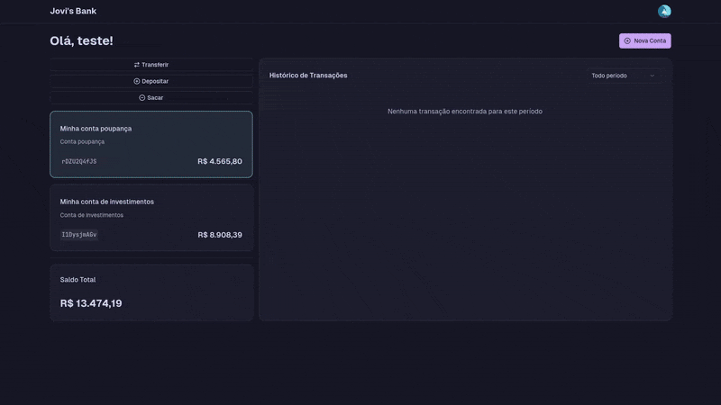

# 💸 Jovi's Bank - Techlab 2025

Minha entrega para o desafio WebApp do TechLab 2025, desafio de programação, IA e automação organizado pela Tech4Humans em parceria com o CEU UNIFEI



## 📜 Índice

- [🚀 Como rodar o projeto](#-como-rodar-o-projeto)
- [❓ Sobre](#-sobre)
- [⚛️ Tecnologias utilizadas]()
- [🏗️ Estrutura do projeto]()
- [🤓 Principais decisões arquiteturais]()
- [🧪 Testes]()

## 🚀 Como rodar o projeto

Primeiro, clone o repositório por meio do comando:

```sh
git clone https://github.com/joevtap/techlab25.git && cd techlab25
```

O projeto consiste em um _monorepo_ utilizando npm, para instalar as dependências de todos os pacotes do monorepo, utilize o comando na raíz do repositório:

```sh
npm i
```

Você pode rodar os testes por meio do comando:

```sh
npm run test
```

> Rodará os testes unitários presentes no pacote `@techlab25/backend` em `./packages`

Em uma sessão do shell, rode as migrations do banco SQLite por meio do comando:

```sh
npm run migrations -w @techlab25/backend
```

E então, rode o backend em modo de desenvolvimento com:

```sh
npm run dev:backend
```

> Rodará o backend em modo de desenvolvimento utilizando as variáveis de ambiente definidas em `./packages/backend/.env.development`

Em outra sessão do shell, rode o frontend em modo de desenvolvimento com:

```sh
npm run dev:frontend
```

> Rodará o frontend em modo de desenvolvimento utilizando as variáveis de ambiente definidas em `./packages/frontend/.env.development`

Se não modificou nenhuma variável de ambiente, o frontend estará rodando em http://localhost:5173.

Acesse a referência da API do backend em http://localhost:8080/reference.

## ❓ Sobre

> O enunciado do desafio se encontra [Aqui](<https://github.com/tech4humans-brasil/techlab-ceu/blob/main/Finan%C3%A7as%20(Webapp)/Desafio%20WebApp.pdf>)

O projeto consiste em uma pequena aplicação financeira em que é possível criar, listar, editar e deletar contas bancárias, além de realizar operações financeiras entre elas.

Além do proposto no enunciado do desafio, minha implementação inclui uma funcionalidade de cadastro e autenticação do usuário. Fiz essa adição porque senti que era algo que faltava para dar mais sentido à aplicação: contas bancárias terem donos e um usuário poder se identificar para operar apenas em cima de suas contas.

A implementação consiste em um backend e um frontend, os dois utilizando a linguagem typescript e se comunicando por meio de uma API HTTP. Toda a lógica de negócios se encontra no backend, mas a validação das entradas do usuário é feita em ambas as pontas.

Mais detalhes sobre o backend e o frontend podem ser encontrados em suas respectivas pastas:

- [Backend](./packages/backend/README.md)
- [Frontend](./packages/frontend/README.md)

## ⚛️ Tecnologias utilizadas

- Node (v22.15.1)
- Typescript
- Jest
- Inversify
- TypeORM
- SQLite
- Git
- Scalar UI
- OpenAPI Spec

- React
- TailwindCSS
