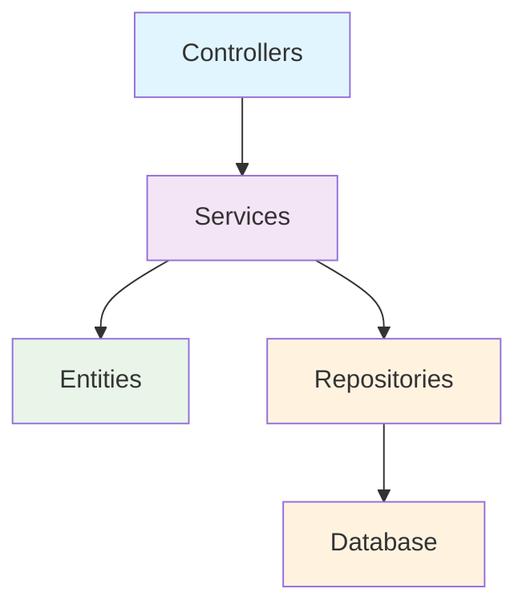
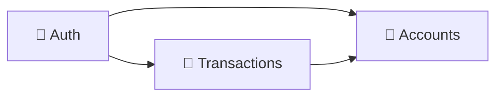
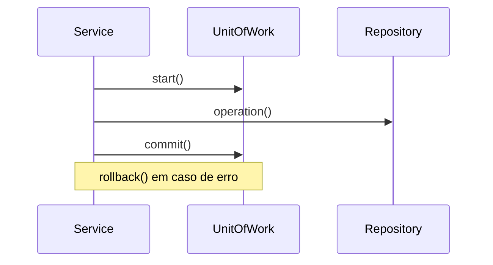
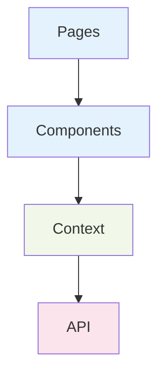

# 💸 Jovi's Bank - Techlab 2025

Minha entrega para o desafio WebApp do TechLab 2025, desafio de programação, IA e automação organizado pela Tech4Humans em parceria com o CEU UNIFEI


## 📜 Índice

- [🚀 Como rodar o projeto](#-como-rodar-o-projeto)
- [❓ Sobre](#-sobre)
- [⚛️ Tecnologias utilizadas](#️-tecnologias-utilizadas)
- [🏗️ Estrutura do projeto](#️-estrutura-do-projeto)
- [🤓 Principais decisões arquiteturais](#-principais-decisões-arquiteturais)
- [🧠 Lógica de Desenvolvimento](#-lógica-de-desenvolvimento)
- [🧪 Testes](#-testes)

## 🚀 Como rodar o projeto

Primeiro, clone o repositório por meio do comando:

```sh
git clone https://github.com/joevtap/techlab25.git && cd techlab25
```

O projeto consiste em um _monorepo_ utilizando npm, para instalar as dependências de todos os pacotes do monorepo, utilize o comando na raíz do repositório:

```sh
npm i
```

Você pode rodar os testes por meio do comando:

```sh
npm run test
```

> Rodará os testes unitários presentes no pacote `@techlab25/backend` em `./packages`

Em uma sessão do shell, rode as migrations do banco SQLite por meio do comando:

```sh
npm run migrations -w @techlab25/backend
```

E então, rode o backend em modo de desenvolvimento com:

```sh
npm run dev:backend
```

> Rodará o backend em modo de desenvolvimento utilizando as variáveis de ambiente definidas em `./packages/backend/.env.development`

Em outra sessão do shell, rode o frontend em modo de desenvolvimento com:

```sh
npm run dev:frontend
```

> Rodará o frontend em modo de desenvolvimento utilizando as variáveis de ambiente definidas em `./packages/frontend/.env.development`

Se não modificou nenhuma variável de ambiente, o frontend estará rodando em http://localhost:5173.

Acesse a referência da API do backend em http://localhost:8080/reference.

## ❓ Sobre

> O enunciado do desafio se encontra [Aqui](<https://github.com/tech4humans-brasil/techlab-ceu/blob/main/Finan%C3%A7as%20(Webapp)/Desafio%20WebApp.pdf>)

O projeto consiste em uma pequena aplicação financeira em que é possível criar, listar, editar e deletar contas bancárias, além de realizar operações financeiras entre elas.

Além do proposto no enunciado do desafio, minha implementação inclui uma funcionalidade de cadastro e autenticação do usuário. Fiz essa adição porque senti que era algo que faltava para dar mais sentido à aplicação: contas bancárias terem donos e um usuário poder se identificar para operar apenas em cima de suas contas.

A implementação consiste em um backend e um frontend, os dois utilizando a linguagem typescript e se comunicando por meio de uma API HTTP. Toda a lógica de negócios se encontra no backend, mas a validação das entradas do usuário é feita em ambas as pontas.

Mais detalhes sobre o backend e o frontend podem ser encontrados em suas respectivas pastas:

## ⚛️ Tecnologias utilizadas

### Backend

- **Node.js** (v22.15.1) - Runtime JavaScript server-side
- **TypeScript** - Linguagem principal para type safety e produtividade
- **Express** - Framework web minimalista para APIs REST
- **TypeORM** - ORM para TypeScript, escolhido por sua excelente integração com TypeScript e recursos avançados de mapeamento objeto-relacional
- **SQLite** - Banco de dados relacional embarcado, ideal para desenvolvimento e prototipagem
- **Inversify** - Container de injeção de dependências para implementar inversão de controle
- **Jest** - Framework de testes unitários
- **Zod** - Biblioteca de validação de esquemas TypeScript-first
- **bcrypt** - Para hash de senhas
- **nanoid** - Geração de IDs únicos
- **JOSE** - Implementação de JWT para autenticação
- **Scalar UI** - Interface para documentação OpenAPI

### Frontend

- **React** - Biblioteca para construção de interfaces de usuário
- **TypeScript** - Type safety no frontend
- **Vite** - Build tool moderna e rápida
- **TailwindCSS** - Framework CSS utility-first para estilização rápida
- **shadcn/ui** - Sistema de componentes baseado em Radix UI e TailwindCSS, escolhido pela qualidade dos componentes, acessibilidade nativa e facilidade de customização
- **React Hook Form** - Gerenciamento de formulários
- **Zod** - Validação de schema

### Ferramentas e Customização

- **tweakcn.com** - Ferramenta utilizada para personalização do tema do shadcn/ui, permitindo gerar paletas de cores customizadas e configurações de design system específicas para o projeto
- **Modo Dark/Light** - Implementado usando a estratégia de CSS variables e _media query_ que seleciona a preferência do navegador do usuário como padrão

## 🏗️ Estrutura do projeto

O projeto está organizado como um monorepo utilizando npm workspaces, facilitando o compartilhamento de dependências e scripts entre os pacotes.

```
techlab25/
├── packages/
│   ├── backend/                  # API REST em Node.js/TypeScript
│   │   ├── src/
│   │   │   ├── controllers/      # Controladores HTTP
│   │   │   ├── services/         # Regras de negócio
│   │   │   ├── entities/         # Entidades de domínio
│   │   │   ├── repositories/     # Interfaces e implementações de repositórios
│   │   │   ├── infrastructure/   # Configurações de infraestrutura (ORM, DI)
│   │   │   ├── dtos/             # Data Transfer Objects
│   │   │   ├── errors/           # Classes de erro personalizadas
│   │   │   └── middleware/       # Middlewares Express
│   │   └── public/               # Documentação OpenAPI
│   └── frontend/                 # Interface de usuário em React
│       ├── src/
│       │   ├── components/       # Componentes React reutilizáveis
│       │   ├── pages/            # Páginas da aplicação
│       │   ├── context/          # Context API para gerenciamento de estado
│       │   ├── hooks/            # Custom hooks
│       │   ├── types/            # Definições de tipos TypeScript
│       │   └── lib/              # Utilitários e configurações
│       └── public/               # Assets estáticos
├── docs/                         # Documentação e diagramas
└── package.json                  # Configuração do monorepo
```

### Arquitetura do Backend

O backend segue os princípios da **Clean Architecture** e **Domain-Driven Design (DDD)**, organizando o código em camadas bem definidas:



### Contextos Delimitados (DDD)

A aplicação é dividida em contextos delimitados seguindo os princípios do DDD:



### Padrão Unit of Work

O backend implementa o padrão **Unit of Work** para gerenciar transações de banco de dados de forma consistente:



### Arquitetura do Frontend

O frontend utiliza React com Context API para gerenciamento de estado e componentes organizados por domínio:



## 🤓 Principais decisões arquiteturais

### 1. **Monorepo com NPM Workspaces**

**Decisão**: Organizar o projeto como um monorepo utilizando NPM Workspaces  
**Justificativa**:

- Facilita o compartilhamento de dependências e configurações entre frontend e backend
- Simplifica o desenvolvimento local com scripts centralizados
- Reduz a complexidade de gerenciamento de múltiplos repositórios

### 2. **Clean Architecture + DDD no Backend**

**Decisão**: Implementar Clean Architecture combinada com Domain-Driven Design  
**Justificativa**:

- **Separation of Concerns**: Cada camada tem responsabilidades bem definidas
- **Testabilidade**: Regras de negócio independentes de frameworks e infraestrutura
- **Flexibilidade**: Facilita mudanças de tecnologia sem afetar regras de negócio
- **Manutenibilidade**: Código mais legível e organizadamente estruturado
- **Domínio Central**: Regras de negócio ficam no centro, protegidas de mudanças externas

### 3. **Inversão de Dependência com Inversify**

**Decisão**: Utilizar container de injeção de dependências  
**Justificativa**:

- **Desacoplamento**: Módulos dependem apenas de abstrações (interfaces)
- **Testabilidade**: Facilita criação de mocks e stubs para testes
- **Configuração Centralizada**: Todas as dependências configuradas em um local
- **Princípio da Inversão de Dependência**: Implementa o "D" do SOLID

### 4. **Padrão Unit of Work**

**Decisão**: Implementar Unit of Work para gerenciamento de transações  
**Justificativa**:

- **Consistência de Dados**: Garante que operações sejam atômicas
- **Performance**: Agrupa múltiplas operações em uma única transação
- **Controle de Concorrência**: Evita problemas de estado inconsistente
- **Rollback Automático**: Em caso de erro, todas as operações são desfeitas

### 5. **Validação Dupla (Frontend + Backend)**

**Decisão**: Implementar validação tanto no frontend quanto no backend usando Zod  
**Justificativa**:

- **Segurança**: Backend valida independente do que vem do frontend
- **UX**: Frontend fornece feedback imediato ao usuário
- **Consistência**: Mesmo schema de validação compartilhado (Zod)
- **Programação Defensiva**: Múltiplas camadas de proteção contra dados inválidos

### 6. **Tipo Monetário como Inteiro**

**Decisão**: Armazenar valores monetários como inteiros (centavos) no banco de dados  
**Justificativa**:

- **Precisão**: Evita problemas de arredondamento com ponto flutuante
- **Consistência**: Todos os cálculos financeiros mantêm precisão decimal
- **Performance**: Operações com inteiros são mais rápidas que decimais
- **Padrão da Indústria**: Prática comum em sistemas financeiros

### 7. **SQLite para Desenvolvimento**

**Decisão**: Usar SQLite como banco de dados embarcado  
**Justificativa**:

- **Simplicidade**: Zero configuração para desenvolvimento
- **Portabilidade**: Banco de dados em arquivo único
- **Desenvolvimento Rápido**: Ideal para prototipagem e testes
- **Compatibilidade**: Pode ser migrado para PostgreSQL/MySQL em produção

### 8. **Context API no Frontend**

**Decisão**: Usar React Context API ao invés de Redux/Zustand  
**Justificativa**:

- **Simplicidade**: Para escopo do projeto, Context API é suficiente
- **Zero Dependencies**: Nativo do React, não adiciona complexidade
- **Type Safety**: Integração natural com TypeScript
- **Padrão Reducer**: Organiza state updates de forma previsível

### 9. **Autenticação JWT Simplificada**

**Decisão**: Implementar autenticação básica stateless com JWT  
**Justificativa**:

- **Subdomínio Genérico**: Autenticação não é core business, apenas identifica usuários
- **Princípio KISS**: Implementação simples e funcional
- **Scalabilidade**: Não requer armazenamento de sessão no servidor
- **Interoperabilidade**: Padrão amplamente aceito para APIs REST

### 10. **Aplicação Estratégica do DDD**

**Decisão**: Focar no DDD Estratégico, não implementar DDD Tático completo  
**Justificativa**:

#### **DDD Estratégico Aplicado**:

- **Linguagem Ubíqua**: Terminologia consistente (Account, Transaction, User)
- **Contextos Delimitados**: Separação clara entre Autenticação, Contas e Transações
- **Subdomínios Core**: Gestão de contas e transações (core business)
- **Subdomínios Genéricos**: Autenticação de usuários

#### **DDD Tático NÃO Aplicado**:

- **Eventos de Domínio**: Comunicação síncrona entre módulos via interfaces
- **Aggregates Complexos**: Entidades simples sem agregados elaborados
- **Domain Services Avançados**: Lógica concentrada nos Application Services
- **Repository Pattern Puro**: Implementação simplificada para o escopo do projeto

**Motivo**: Para o escopo de um projeto de demonstração, o DDD Estratégico oferece os benefícios de organização e arquitetura sem a complexidade adicional do DDD Tático completo.

## 🧠 Lógica de Desenvolvimento

### Funcionalidades Principais

#### 1. **Sistema de Autenticação Simplificado**

- **Cadastro de Usuários**: Hash de senhas com bcrypt
- **Login**: Validação simples de credenciais e geração de JWT
- **Middleware de Autenticação**: Verificação de tokens em rotas protegidas
- **Princípio KISS**: Implementação funcional sem complexidades desnecessárias
- **Subdomínio Genérico**: Foco apenas na identificação do usuário

#### 2. **Gestão de Contas Bancárias**

- **Criação de Contas**: Validação de dados, geração de número único, definição de saldo inicial
- **Tipos de Conta**: Conta Corrente, Poupança e Investimentos
- **Operações CRUD**: Criar, listar, editar e deletar contas
- **Validações de Negócio**:
  - Saldo mínimo de R$ 1,00
  - Saldo máximo de R$ 10.000,00
  - Usuário só pode operar suas próprias contas

#### 3. **Sistema de Transações**

- **Transferências**: Entre contas do mesmo usuário com validação de saldo
- **Depósitos (Adicionar Fundos)**: Crédito direto na conta
- **Saques (Retirar Fundos)**: Débito com validação de saldo suficiente
- **Histórico**: Listagem com filtros por período (7 dias, 30 dias, 90 dias, 1 ano, todos)
- **Atomicidade**: Todas as operações são transacionais (Unit of Work)

### Padrões de Validação

#### Entidades de Domínio

- **Account**: Validação de tipo, saldo mínimo/máximo, nome da conta
- **Transaction**: Validação de valor, contas origem/destino, tipos de transação
- **User**: Validação de email único, senha forte, username

#### Builder Pattern para Transações

- **TransferBuilder**: Constrói transações de transferência
- **CreditBuilder**: Constrói transações de crédito
- **DebitBuilder**: Constrói transações de débito
- Validações específicas para cada tipo de transação

### Tratamento de Erros

#### Hierarquia de Erros Personalizados

- **DomainError**: Classe base para erros de domínio
- **BusinessRuleViolationError**: Violações de regras de negócio
- **NotFoundError**: Recursos não encontrados
- **InvalidCredentialsError**: Credenciais inválidas
- **InsufficientFundsError**: Saldo insuficiente
- **UserAlreadyExistsError**: Usuário já existe

#### Middleware de Tratamento Global

- Captura e padroniza respostas de erro
- Log de erros para debugging
- Retorna mensagens user-friendly

## 🧪 Testes

### Estratégia de Testes

O projeto implementa **testes unitários** focados na lógica de negócio do backend, garantindo a confiabilidade das regras financeiras críticas.

### Principais Testes Implementados

#### **Entidades de Domínio**

- **Account**: Validações de criação, tipos e saldos
- **Transaction**: Builders de transação e validações de negócio
- **User**: Criação de usuário e validações de dados

#### **Services (Regras de Negócio)**

- **AccountService**: CRUD de contas, validações de propriedade e saldos
- **TransactionService**: Transferências, validações de saldo, operações atômicas
- **UserService**: Cadastro, autenticação e hash de senhas

### Execução dos Testes

```bash
npm run test
```

A estratégia priorizou testar a lógica de negócio crítica usando mocks para isolamento, garantindo que as regras financeiras funcionem corretamente independente da infraestrutura.
